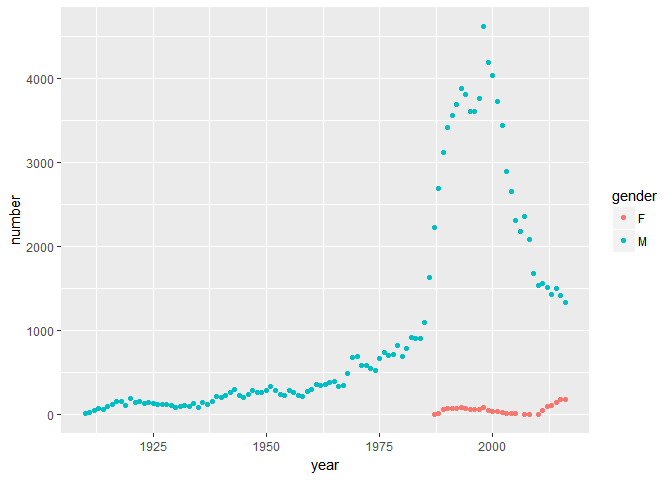
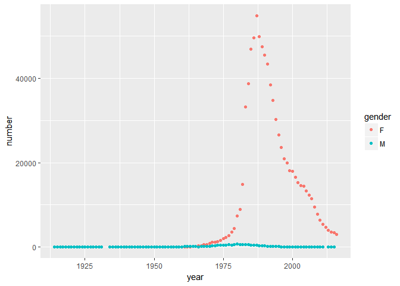
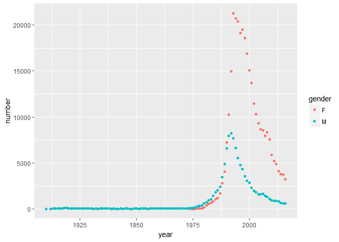

Name Popularity Data
================
Spencer Workman
May 31, 2018

Name Data
---------

The data, obtained from Kaggle, contain the frequencey of use of baby names from 1910 through 2016. I wrote a short script that allows for a quick visualization based on the popularity of a name over time using `ggplot2` .

``` r
names<-read.csv("usa_names_agg.csv")
```

``` r
nameplot<-function(x){
  sub<-subset(names,name==x)
  ggplot(data=sub,aes(year,number,color=gender))+geom_point()
}
```

Lets look at a couple examples

``` r
nameplot("Spencer")
```



We can see that there there was a spike in popularity for the name Spencer for males starting in the early 80's and continuing through the early 2010s. Additionally, we can see that during the populariry spike the trend led to some females being named Spencer as well.

``` r
nameplot("Ashley")
```



This is interseting because we can see a hard spike in the popularity of the name Ashley for females, followed by a sharp decline.

``` r
nameplot("Taylor")
```



Taylor is a traditionally gender neuteral name, which is reflected in the plot below. While Taylor seems to be consistnenly more popular for females, we can see that there is a significant amount of male Taylors. Additionally, the popularity of the name for both genders seems to peak around the same time.

### Gender Neuteral Names

An interesting question that can be learned from this data set is what names have been the most gender nuteral. For this investigation we will subset our data to names with at least 100 occurances per year of use.

``` r
names2<-subset(names,number>100)
y<-tapply(X=names2$number,INDEX = list(names2$name,names2$gender),sum)
comp<-y[complete.cases(y),]
comp<-as.data.frame(comp)
diff<-mutate(comp,dif= (abs(M-F))/(M+F))
i<-which(diff$dif<0.1)
comp[i,]
```

    ##             F     M
    ## Amari   11830 14394
    ## Baby     3506  4280
    ## Infant   3290  3580
    ## Jackie  85014 73735
    ## Jael      642   745
    ## Justice 14098 14419
    ## Kerry   45078 45100
    ## Kris    10241  9132
    ## Landry   1858  1791
    ## Oakley   1619  1840
    ## Palmer    430   440
    ## Quinn   21965 26067
    ## Riley   93334 84484
    ## Robbie  17738 15105
    ## Ryley     458   467
    ## Unknown  6234  5814

Now we can see a nice table of names that have proven to be somewhat gender nuteral overtime. (&lt;10% skewed by either gender)
